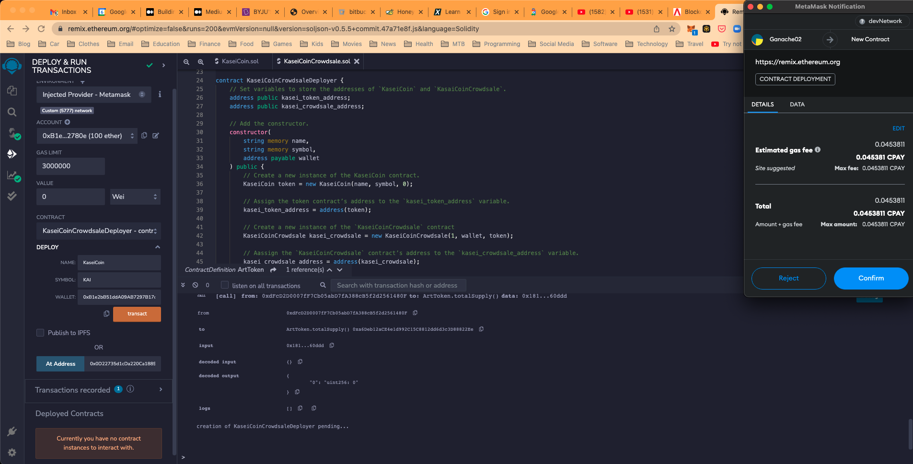

# KASEI Coin

KaseiCoin is a ERC-20 compliant fungible token that is minted using a Crowdsale contract from the OpenZeppelin Solidity library which allows people to convert their money to KaseiCoin (KAI).

---

## Requirements

REMIX IDE version 1.3.4

This application was writen in Solidity within the Remix IDE desktop application and compiled using version 0.5.0

---

## Getting Started

This fungible token is based on 3 contracts
- Creation of the token contract.
- Crowdsale of the token contract.
- Deployer of the contracts.  

### **KaeiCoin Token Contract**
This contract token used OpenZeppelin `ERC20`, `ERC20Detailed` and `ERC20Mintable` by first importing the librairies.

Calling the `ERC20Detailed` within the constructor definition and passing the `name`, `symbol` and `decimal`.

```
contract KaseiCoin is ERC20, ERC20Detailed, ERC20Mintable {
    constructor(
        string memory name,
        string memory symbol,
        uint initial_supply
    )
        ERC20Detailed(name, symbol, 18)
        public
    {
        
    }
}
```
The contract is then compiled using Remix IDE 0.5.5 compiler.

### **KaseiCoin Crowdsale Contract**
For the crowdsale contract we go back to OpenZeppelin but this time importing `Crowdsale` and `MintedCrowdsale` librairies.

Calling the `Crowdsale` within the constructor definition and passing the `rate`, `wallet` and `token`.

```
contract KaseiCoinCrowdsale is Crowdsale, MintedCrowdsale {
    
    constructor(
        uint rate,
        address payable wallet,
        KaseiCoin token
    )   
        public 
        Crowdsale(rate, wallet, token)
    {

    }
}
```

The contract is then compiled using Remix IDE 0.5.5 compiler.

### **KaseiCoin Deployer Contract**
In the deployer contract we define two addresses for the `KaseiCoin` and for the `Crowdsale`

We then go and:

1. Create a `KaseiCoin`
2. Assign the coin address to the contract
3. Create a new instance of the crowdsale and assign it to the contract address.
4. Set the crowdsale contract as a minter
5. and finaly, have the deployer contract renounce its minter role.

```
contract KaseiCoinCrowdsaleDeployer {
    address public kasei_token_address;
    address public kasei_crowdsale_address;

    constructor(
        string memory name,
        string memory symbol,
        address payable wallet
    ) public {
        KaseiCoin token = new KaseiCoin(name, symbol, 0);
        kasei_token_address = address(token);
        KaseiCoinCrowdsale kasei_crowdsale = new KaseiCoinCrowdsale(1, wallet, token);
        kasei_crowdsale_address = address(kasei_crowdsale);
        token.addMinter(kasei_crowdsale_address);
        token.renounceMinter();
    }
}
```

The contract is then compiled using Remix IDE 0.5.5 compiler.


---

## Evaluation Evidence

In Remix, within the Compile section, compile the KaseiCoin contract.


Then compile the KaseiCoinCrowdsale contract.


Finaly compile the KaseiCoinCrowdsaleDeployer contract.


In Remix, within the Deploy section, you first deploy the KaseiCoinCrowsaleDeployer contract.

To Deploy add the `name`, `symbol` and `wallet`.
Once deployed, it will add it to the Deployed contracts section at the bottom left of the UI.

Call the `kaseiCrowdsale` and `KasaiToken` by pushing on the buttons to get the addresses.



Copy/Paste the `kaseiCrowdsale` address into the "At Address" after selecting the crowdsale contract and deploy.


Do the same for the KaseiCoin contract and deploy.

To see an example of how to interact with the deployed contract see this first example.

https://user-images.githubusercontent.com/35586344/183268668-7220b626-ddc3-4c61-8516-38f92ca858be.mp4

Here's an example of a second transaction and how it adds to the first transaction.

https://user-images.githubusercontent.com/35586344/183268671-ffbdf375-11ea-4269-8793-1d87a6581472.mp4

Finaly here's a represenation of the metamask account match the results from our transaction.

https://user-images.githubusercontent.com/35586344/183268674-d545803d-5cd2-4381-a622-40ef87842315.mp4


---

## Contributors

This application originated from a Berkeley Bootcamp.

For any inquieries, feedbacks or comments about this project please email me at  [yanickw@gmail.com](mailto:yanickw@gmail.com)

I can also be reached on  [LinkedIn](https://www.linkedin.com/in/yanickwilisky/)  or  [Twitter](https://twitter.com/yanickwilisky).

---

## License

MIT License

Copyright (c) 2022 Yanick Wilisky

Permission is hereby granted, free of charge, to any person obtaining a copy of this software and associated documentation files (the "Software"), to deal in the Software without restriction, including without limitation the rights to use, copy, modify, merge, publish, distribute, sublicense, and/or sell copies of the Software, and to permit persons to whom the Software is furnished to do so, subject to the following conditions:

The above copyright notice and this permission notice shall be included in all copies or substantial portions of the Software.

THE SOFTWARE IS PROVIDED "AS IS", WITHOUT WARRANTY OF ANY KIND, EXPRESS OR IMPLIED, INCLUDING BUT NOT LIMITED TO THE WARRANTIES OF MERCHANTABILITY, FITNESS FOR A PARTICULAR PURPOSE AND NONINFRINGEMENT. IN NO EVENT SHALL THE AUTHORS OR COPYRIGHT HOLDERS BE LIABLE FOR ANY CLAIM, DAMAGES OR OTHER LIABILITY, WHETHER IN AN ACTION OF CONTRACT, TORT OR OTHERWISE, ARISING FROM, OUT OF OR IN CONNECTION WITH THE SOFTWARE OR THE USE OR OTHER DEALINGS IN THE SOFTWARE.
